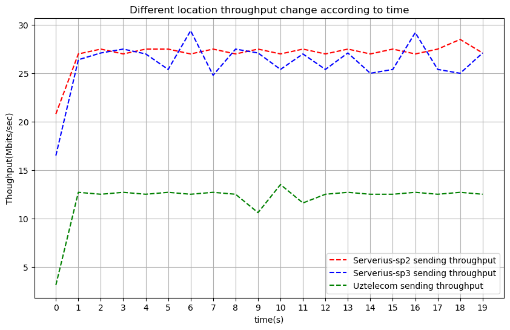

# Environment Setting 
| Setting |  Info(Server) | Info(Client)|
| --- | --- |--- |
| Operating System |  Windows | Windows | 
| Wireless Channel | Intel(R) Wi-Fi 6 AX201  |--|
| Wired Channel  |  LRealtek USB GbE Family Controller |Intel(R) I210 Gigabit Network |

# 1 Throughput
## 1.1 Throughput comparison case : different interface
### 1.1.1 Throughput setting
| Setting |  Info(Server) | Info(Client)|
| --- | --- |--- |
|location| Harbor| Campus|
|Interface| wired| wired|
|IP| 10.240.136.29| 10.68.75.53|
|command| .\iperf3.exe -s| .\iperf3.exe -c 10.240.136.29 -O 1 -t 20|

|  | 1s | 3s | 5s | 7s | 9s | 12s | 15s | 20s | AVG |
| --- | --- | --- | --- | --- | --- | --- | --- | --- | --- |
| Bandwidth | 517 Mbits/s | 510 Mbits/s | 509 Mbits/s | 494 Mbits/s | 511 Mbits/s | 522 Mbits/s | 426 Mbits/s | 446 Mbits/s |495 Mbits/s |


### 1.1.2 Throughput setting
| Setting |  Info(Server) | Info(Client)|
| --- | --- |--- |
|location| Harbor| Campus|
|Interface| wireless| wired|
|IP| 10.185.179.41| 10.68.75.53|
|command| .\iperf3.exe -s -B 10.185.179.41| .\iperf3.exe -c 10.185.179.41 -O 1 -t 20|

|  | 1s | 3s | 5s | 7s | 9s | 12s | 15s | 20s | AVG |
| --- | --- | --- | --- | --- | --- | --- | --- | --- | --- |
| Bandwidth | 91.7 Mbits/s | 95.1 Mbits/s | 81.9 Mbits/s | 96.5 Mbits/s | 96.8 Mbits/s | 95.9 Mbits/s | 86.8 Mbits/s | 92.3 Mbits/s |92.7 Mbits/s |


> It's easy to understand that wired channel has better bandwidth due to the worse noisy for wirless signal as well as the multiple user for icampus WIFI.

## Throughput comparsion case: buffer length


## Throughput comparison case : different location
In this case, I test several public Iperf servers from https://iperf.fr/iperf-servers.php.

*Servers Info:*
| Hosting |Location|Speed|IP|Port|
| --- | --- |--- |--- |--- |
|Serverius DataCenter2|Netherlands|10 Gbit/s|speedtest2.serverius.net|5002|
|Serverius DataCenter3|Netherlands|10 Gbit/s|speedtest3.serverius.net|5002|
|Uztelecom |Uzbekistan Tashkent|10 Gbit/s| speedtest.uztelecom.uz| 5200|


|  | 1s | 3s | 5s | 7s | 9s | 12s | 15s | 20s | AVG |
| --- | --- | --- | --- | --- | --- | --- | --- | --- | --- |
| Bandwidth-sp2 | 20.8 Mbits/s | 27.5 Mbits/s | 27.5 Mbits/s | 27.0 Mbits/s | 27.0 Mbits/s | 27.0 Mbits/s | 27.0 Mbits/s | 27.1 Mbits/s |27.0 Mbits/s |
| Bandwidth-sp3 | 16.5 Mbits/s | 27.1 Mbits/s | 27.0 Mbits/s | 29.4 Mbits/s | 27.5 Mbits/s | 25.4 Mbits/s | 25.0 Mbits/s | 27.1 Mbits/s |26.0 Mbits/s |
| Bandwidth-uz | 3.12 Mbits/s | 12.5 Mbits/s | 12.5 Mbits/s | 12.5 Mbits/s | 12.5 Mbits/s | 13.5 Mbits/s | 12.5 Mbits/s | 12.5 Mbits/s |12.0 Mbits/s |

**Throughput over time**


> Analysis： With respect to speedtest2 and speedtest3, the difference is caused by the data traffic of there two data center. We can find the data traffic at https://speedtest2.serverius.net/. Then we can notice data center3 has havier traffic which maight cause the smaller bandwidth during my test. With repect to **Uztelecom**, the very small bandwidth might be raised by some router nodes in in the path even though these three servers have the same claimed bandwidth. Epecially, we can use **Tracert** to test the router along the path. The result implies there might be some bottleneck in the path.

```
PS C:\Users\LID0E\source\Tools\iperf3.1.3_64> Tracert -d speedtest.uztelecom.uz

Tracing route to speedtest.uztelecom.uz [195.69.189.215]
over a maximum of 30 hops:

  1    <1 ms    <1 ms     *     10.68.74.126
  2    <1 ms    <1 ms    <1 ms  10.126.145.66
  3    <1 ms    <1 ms    <1 ms  10.126.145.66
  4    <1 ms    <1 ms    <1 ms  10.126.146.5
  5     1 ms     1 ms     1 ms  10.126.146.9
  6     1 ms     1 ms     1 ms  10.126.145.5
  7     1 ms     1 ms     1 ms  192.168.11.14
  8     *        *        *     Request timed out.
  9    95 ms    95 ms    95 ms  171.75.8.17
 10   166 ms   166 ms   166 ms  213.249.107.18
 11   165 ms   165 ms   165 ms  195.69.189.44
 12   166 ms   165 ms   165 ms  195.69.189.32
 13   165 ms   166 ms   165 ms  195.69.189.215

Trace complete.
```

## Througput comparsion case : different buffer len

|  | 1s | 3s | 5s | 7s | 9s | 12s | 15s | 20s | AVG |
| --- | --- | --- | --- | --- | --- | --- | --- | --- | --- |
| Bandwidth-64K | 441.0 Mbits/s | 546.0 Mbits/s | 629.0 Mbits/s | 615.0 Mbits/s | 667.0 Mbits/s | 681.0 Mbits/s | 574.0 Mbits/s | 683.0 Mbits/s |618.0 Mbits/s |
| Bandwidth-128K | 642.0 Mbits/s | 674.0 Mbits/s | 674.0 Mbits/s | 677.0 Mbits/s | 668.0 Mbits/s | 638.0 Mbits/s | 675.0 Mbits/s | 639.0 Mbits/s |669.0 Mbits/s |
| Bandwidth-256K | 646.0 Mbits/s | 668.0 Mbits/s | 669.0 Mbits/s | 675.0 Mbits/s | 674.0 Mbits/s | 675.0 Mbits/s | 674.0 Mbits/s | 675.0 Mbits/s |668.0 Mbits/s |
| Bandwidth-512K | 669.0 Mbits/s | 682.0 Mbits/s | 677.0 Mbits/s | 675.0 Mbits/s | 678.0 Mbits/s | 680.0 Mbits/s | 678.0 Mbits/s | 678.0 Mbits/s |677.0 Mbits/s |
| Bandwidth-1024K | 659.0 Mbits/s | 672.0 Mbits/s | 674.0 Mbits/s | 675.0 Mbits/s | 674.0 Mbits/s | 671.0 Mbits/s | 677.0 Mbits/s | 671.0 Mbits/s |672.0 Mbits/s |

**Throughput change over time**

>analysis:Smaller buffers increase system overhead and cause throughput fluctuations, while larger buffers reduce system calls, improving throughput stability and efficiency, especially in high-bandwidth networks.

## About goodput
**Assumption:**
* Every time TCP send the longest packet in the ethernet.
* The transfer data in Iperf includes the cost of all network layer

Let's take:
* Ethernet header cost: 14 Bytes
* IP header cost(IPv4): 20 Bytes
* TCP header cost:      20 Bytes
Ethernet longest frame: 1500 Bytes.

TCP useful data=1500-20-20=1460Bytes,

To send 1460 Bytes, we need 14+1500=1514Bytes data.

In other words, the percentage of good put=1460/1514=96.4%

Consider the throuput and goodput over different interface


>Analysis: Here we just rougly calculate the goodput. If we want to have a more precise number, we need to known more details about the packet.


# 2 Owamp Test

**Packet delay: case 1**

| Info | Server | Client
| --- | --- |--- |
| IP Address  | 10.240.28.81 |10.68.75.202|
| OS | Ubuntu 14.04 |Ubuntu 14.04 |
|location|Harbor|Campus|
|interface|AX88179(wired)|Wired|

|  | 1s | 3s | 5s | 7s | 9s | 12s | 15s | 20s |
|--- | --- | --- | --- | --- | --- | --- | --- | --- |
|delay -localhost| 0.0558 Mbits/s | 0.0739 Mbits/s| 0.0348 Mbits/s | 0.0477 Mbits/s | 0.0372 Mbits/s | 0.0429 Mbits/s |0.041 Mbits/s | 0.0434 Mbits/s |
|delay(c->s,err=1.55ms) | -30.3 Mbits/s | -30.9 Mbits/s| -29.5 Mbits/s | -29.7 Mbits/s | -30.4 Mbits/s | -29.7 Mbits/s |-30.3 Mbits/s | -30.4 Mbits/s |
|delay(s->c,err=1.55ms) | 32.7 Mbits/s | 32.4 Mbits/s| 32.5 Mbits/s | 32.6 Mbits/s | 32.6 Mbits/s | 32.5 Mbits/s |32.6 Mbits/s | 32.5 Mbits/s |


**Packet delay: case 2**

| Info | Server | Client
| --- | --- |--- |
| IP Address  | 10.240.28.81 |10.68.75.202|
| OS | Ubuntu 14.04 |Ubuntu 14.04 |
|location|Harbor|Campus|
|interface|LRealtek(wired)|Wired|

|  | 1s | 3s | 5s | 7s | 9s | 12s | 15s | 20s |
|--- | --- | --- | --- | --- | --- | --- | --- | --- |
|delay(c-s,err=12.6ms)| -29.4 Mbits/s | -30.0 Mbits/s| -29.4 Mbits/s | -30.2 Mbits/s | -29.7 Mbits/s | -30.1 Mbits/s |-29.1 Mbits/s | -30.0 Mbits/s |
|delay(s-c,err=12.6ms) | 33.2 Mbits/s | 33.2 Mbits/s| 33.1 Mbits/s | 33.1 Mbits/s | 33.1 Mbits/s | 33.0 Mbits/s |33.3 Mbits/s | 33.1 Mbits/s |


**Packet delay: case 3**
Here we plot the delay under different interface.
Here I only plot the delay from server to client.
| Link speed | Hops | One-way delay min/median/max (sending) | One-way delay min/median/max (receiving) | Jitter (sending) | Jitter(receiving) |
| --- | --- | --- | --- | --- | --- |
| 1000Mbps(Ugreen) | 2 |  -30.9/-30.4/-15.9 ms, (err=1.55 ms) |  32.3/32.6/32.7 ms, (err=1.55 ms) | 0.8 ms (P95-P50) |  0.1 ms (P95-P50)|
| 1000Mbps(LRealtek) | 2 |  -30.2/-29.7/-27 ms, (err=12.6 ms) | 32.8/33.2/33.5 ms, (err=12.6 ms) | 0.7 ms (P95-P50) |  0.2 ms (P95-P50)|


>analysis: These two cards both can access to ethernet and the link speed both can reach the l000Mbps. But they have different delay performace. Apart from the testing time(few minutes difference), I guess the most important reason is the process speed of these two hardware(Ugreen is much more expensive than LRealtek card.)


