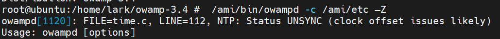
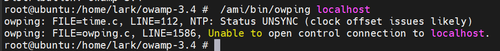
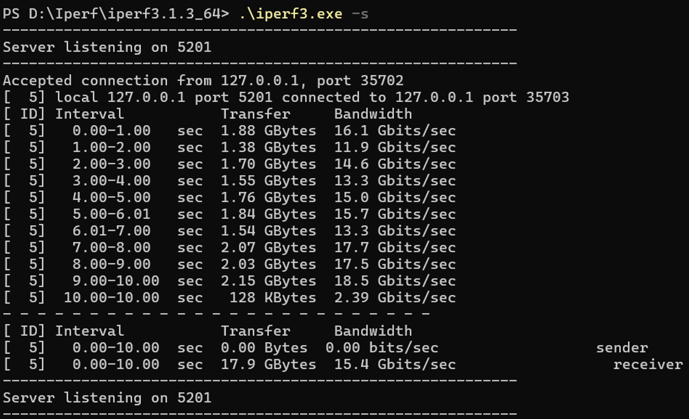
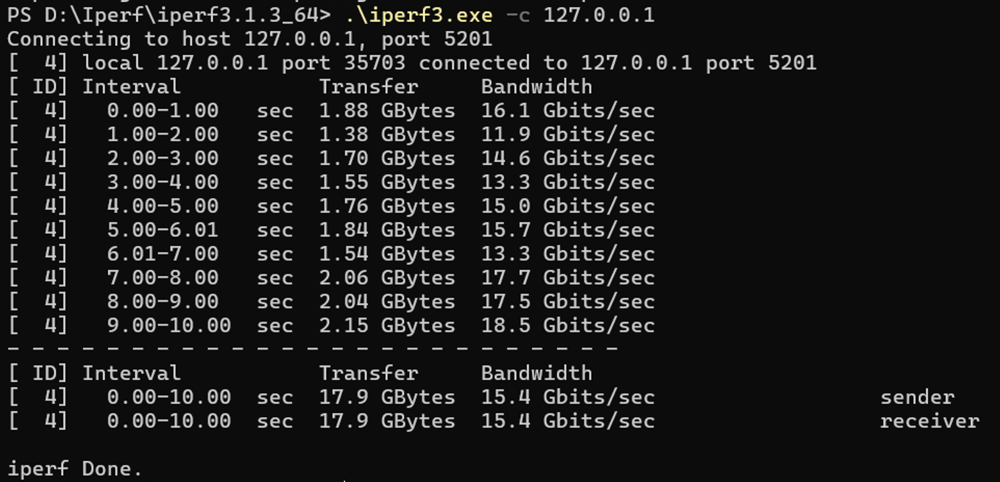
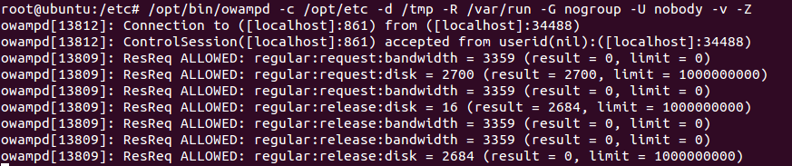
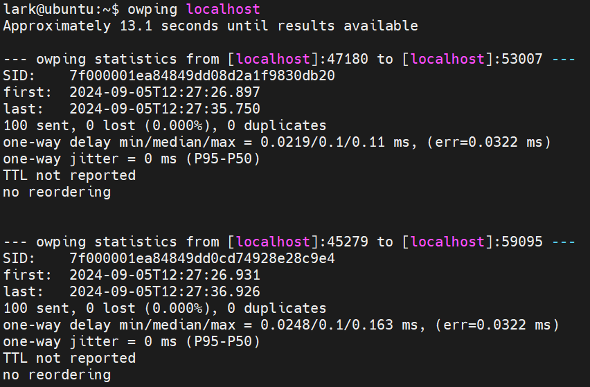

For owamp running
# configure
sudo bash ./configure --prefix=/ami 
make 
make install

现在只有Ubuntu_5_04可以成功编译，但是无法运行



时区设置sudo tzselect


#Iperf(3.1.3_64)
## Localhost test



#ubuntu 14
lark 123456789
root 123
#Ubuntu 14 v2
lark 123
root 123


>cd the path of Iperf

>open the server : .\iperf3.exe -s


#Test scheduele

Metrics: Throughput, Delay(Iperf(Jitter),Ping(RTT))，goodput(calcute myself?)

varables: network interface, location

coms:wireless+campus,wireless+house, wired+campus, wired+house

##Owamp install

apt-get update

apt-get -y install ntp

service ntp start (vim /etc/ntp.conf  add server ip.address of your own ntp server)
 
my windows ip 10.68.75.53

```bash
# Download and unpack
mkdir -p /opt/src/owamp
cd /opt/src/owamp
wget http://software.internet2.edu/sources/owamp/owamp-3.3rc1.tar.gz
```
```bash
# Compile and install
tar xvzf owamp-3.3rc1.tar.gz
cd owamp-3.3rc1
./configure --prefix=/opt
make
make install
```

```bash
# Add /opt to path
echo "/opt/lib" >>/etc/ld.so.conf
ldconfig
sed -i.bak /etc/environment -e's|PATH="|PATH="/opt/sbin:/opt/bin:|g'
export PATH=/opt/sbin:/opt/bin:$PATH
```
```bash
# Create config files
mkdir -p /opt/etc
touch /opt/etc/owampd.conf
# Config
cat<<'__EOF__'>/opt/etc/owampd.limits
limit root with disk=1000M,bandwidth=0,delete_on_fetch=on,allow_open_mode=off
limit regular with parent=root,allow_open_mode=on
assign default regular
__EOF__
```

```
#local test
/opt/bin/owampd -c /opt/etc -d /tmp -R /var/run -G nogroup -U nobody -v -Z 
/opt/bin/owping localhost
```





>tips 
测试的时候发现即使开启了ntp也需要等一段时间才可以进行owampd的指令使用，可能安装openssh-server有用

Tips:
* for thougput, just run the example cmds 
* for goodput,
* for delay, using udp and imcp
