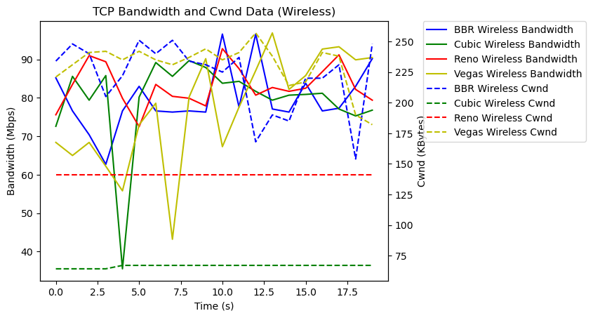
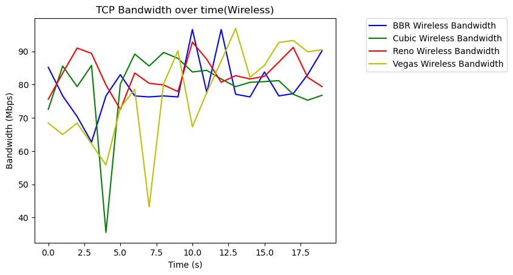
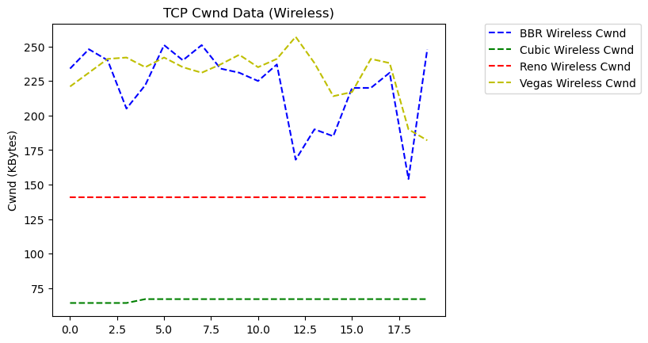
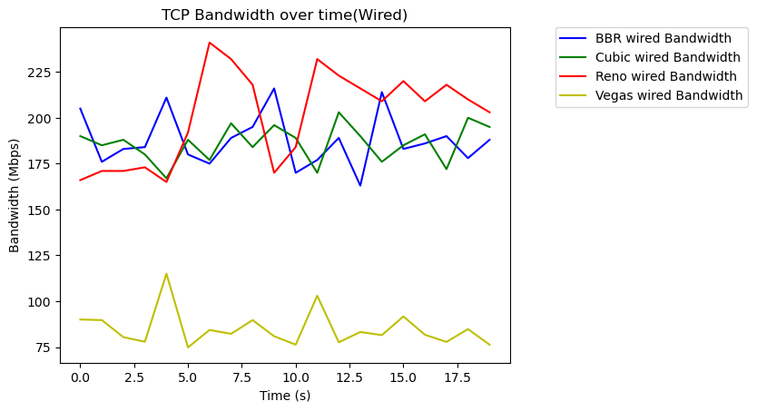
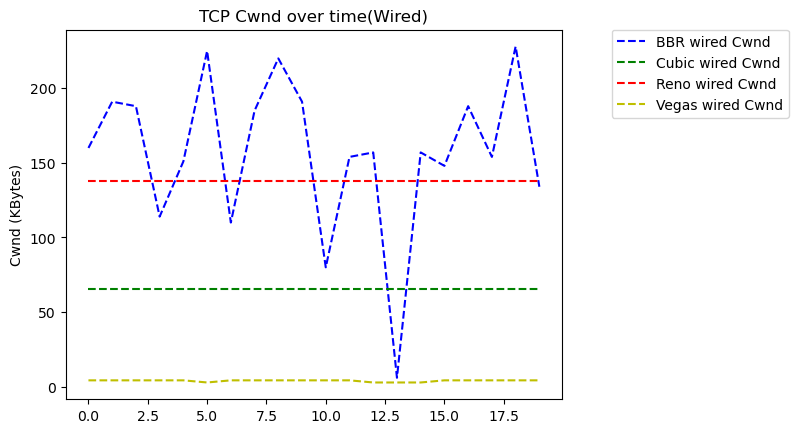
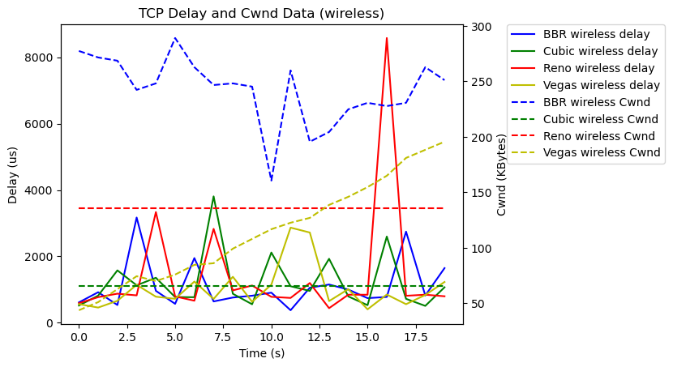
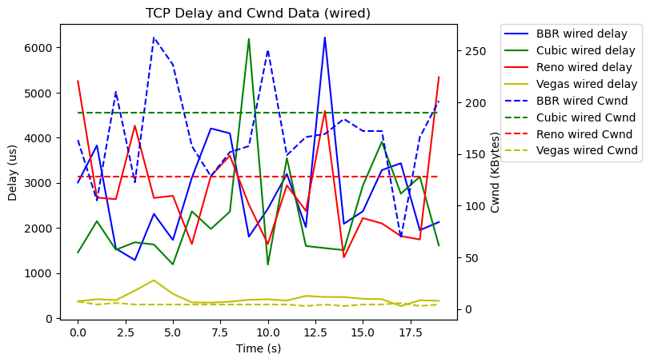
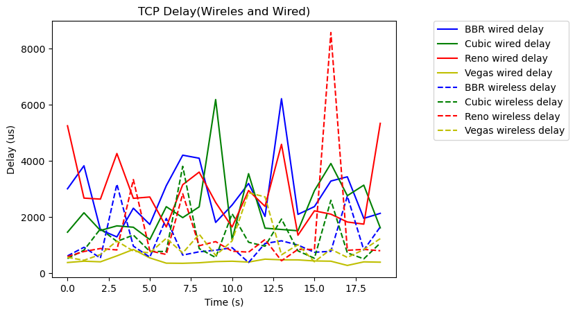
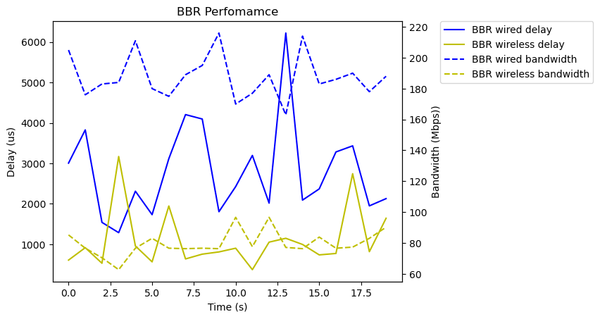

# CS244 Computer Network Assignment2

## Command

1. Change the algorithm
```
sudo vim /etc/sysctl.conf
```

2. Reload the config
```
sudo sysctl -p
```

3. Show the algorithm
```
sysctl net.ipv4.tcp_congestion_control
```

4. Throughput and Delay
```
iperf3 -c 10.68.75.53 -t 20
iperf3 -c 10.68.75.53 -t 20 -J -i 0.1
```

## 1. TCP congestion control algorithm
### 1.1 TCP BBR
TCP BBR (Bottleneck Bandwidth and RTT) is a congestion control algorithm developed by Google to improve network transmission efficiency. Unlike traditional TCP congestion control algorithms (e.g., TCP Reno or TCP CUBIC), which rely heavily on packet loss and congestion window adjustment, TCP BBR employs a bandwidth and delay (RTT)-based mechanism to estimate the network's bottleneck bandwidth and the minimum RTT in order to dynamically adjust the sending rate.

TCP BBR works by actively detecting the current network state by continuously monitoring the available bandwidth and RTT of the network links and estimating the optimal transmission rate (i.e., bottleneck bandwidth) and the shortest delay (i.e., RTT when there is no queuing) of the network. It then controls the data sending rate based on these .

### 1.2 TCP CUBIC
TCP CUBIC is a congestion control algorithm for the Transmission Control Protocol (TCP) designed to optimize TCP transmission performance in high-bandwidth-latency network environments. It is the default TCP congestion control algorithm in the Linux kernel, and is designed to address the lack of performance of traditional TCP congestion control algorithms in high-bandwidth and high-latency networks

When network congestion is detected (e.g., packet loss), CUBIC decreases the congestion window size and then gradually increases the window as a cubic function. Over time, the growth rate accelerates until the maximum bandwidth utilization is reached. When the network stabilizes, CUBIC recovers the pre-packet-loss state more quickly, thus maintaining higher transmission rates in high-bandwidth-latency networks.

### 1.3 TCP Reno
TCP Reno is a popular congestion control algorithm for the Transmission Control Protocol (TCP) with some improvements over TCP Tahoe.The main goal of TCP Reno is to improve network throughput and efficiently adjust transmission rates when congestion is detected.

TCP Reno controls network traffic through four steps: Slow Start, Congestion Avoidance, Fast Retransmission, and Fast Recovery. TCP Reno controls network traffic through four steps, “Slow Start,” “Congestion Avoidance,” “Fast Retransmission,” and “Fast Recovery,” and adjusts the sending rate to minimize packet loss when congestion is detected.

### 1.4 TCP Vegas
TCP Vegas is a delay-based TCP congestion control algorithm proposed by Brakmo and Peterson in 1994. Unlike the classic TCP Tahoe and TCP Reno, TCP Vegas does not rely on packet loss to detect network congestion, but rather measures delay to predict network congestion. Its core idea is to pre-adjust the sending rate before congestion occurs in order to reduce packet loss and improve network utilization.

##2. Algorithm comparison

### 2.1 Throughput
> Wireless

|  | 1s | 3s | 5s | 7s | 9s | 12s | 15s | 20s | AVG |
| --- | --- | --- | --- | --- | --- | --- | --- | --- | --- |
| Bandwidth-BBR | 85.2 Mbits/s | 70.4 Mbits/s | 76.6 Mbits/s | 76.6 Mbits/s | 76.6 Mbits/s | 96.6 Mbits/s | 76.3 Mbits/s | 90.2 Mbits/s |79.8 Mbits/s |
| Bandwidth-CUBIC | 72.6 Mbits/s | 79.4 Mbits/s | 35.5 Mbits/s | 89.2 Mbits/s | 89.7 Mbits/s | 83.8 Mbits/s | 80.7 Mbits/s | 76.8 Mbits/s |79.6 Mbits/s |
| Bandwidth-Reno | 75.6 Mbits/s | 91.0 Mbits/s | 79.9 Mbits/s | 83.5 Mbits/s | 79.9 Mbits/s | 92.8 Mbits/s | 81.7 Mbits/s | 79.4 Mbits/s |83.1 Mbits/s |
| Bandwidth-Vegas | 68.4 Mbits/s | 68.4 Mbits/s | 55.8 Mbits/s | 78.6 Mbits/s | 80.2 Mbits/s | 67.3 Mbits/s | 82.2 Mbits/s | 90.5 Mbits/s |77.4 Mbits/s |


|  | 1s | 3s | 5s | 7s | 9s | 12s | 15s | 20s  |
| --- | --- | --- | --- | --- | --- | --- | --- | --- |
| Cwnd-BBR | 234.0 KBytes | 240.0 KBytes | 222.0 KBytes | 240.0 KBytes | 234.0 KBytes | 225.0 KBytes | 185.0 KBytes | 248.0 KBytes |
| Cwnd-CUBIC | 64.2 KBytes | 64.2 KBytes | 67.0 KBytes | 67.0 KBytes | 67.0 KBytes | 67.0 KBytes | 67.0 KBytes | 67.0 KBytes|
| Cwnd-Reno | 141.0 KBytes | 141.0 KBytes | 141.0 KBytes | 141.0 KBytes | 141.0 KBytes | 141.0 KBytes | 141.0 KBytes | 141.0 KBytes |
| Cwnd-Vegas | 221.0 KBytes | 241.0 KBytes | 235.0 KBytes | 235.0 KBytes | 237.0 KBytes | 235.0 KBytes | 214.0 KBytes | 182.0 KBytes |







>wired

**BBR**


|  | 1s | 3s | 5s | 7s | 9s | 12s | 15s | 20s | AVG |
| --- | --- | --- | --- | --- | --- | --- | --- | --- | --- |
| Bandwidth-BBR | 205.0 Mbits/s | 183.0 Mbits/s | 211.0 Mbits/s | 175.0 Mbits/s | 195.0 Mbits/s | 170.0 Mbits/s | 214.0 Mbits/s | 188.0 Mbits/s |188.0 Mbits/s |
| Bandwidth-CUBIC | 190.0 Mbits/s | 188.0 Mbits/s | 167.0 Mbits/s | 177.0 Mbits/s | 184.0 Mbits/s | 189.0 Mbits/s | 176.0 Mbits/s | 195.0 Mbits/s |186.0 Mbits/s |
| Bandwidth-RENO | 166.0 Mbits/s | 171.0 Mbits/s | 165.0 Mbits/s | 241.0 Mbits/s | 218.0 Mbits/s | 184.0 Mbits/s | 209.0 Mbits/s | 203.0 Mbits/s |201.0 Mbits/s |
| Bandwidth-VEGAS | 90.0 Mbits/s | 80.4 Mbits/s | 115.0 Mbits/s | 84.3 Mbits/s | 89.7 Mbits/s | 76.3 Mbits/s | 81.5 Mbits/s | 76.3 Mbits/s |84.9 Mbits/s |

|  | 1s | 3s | 5s | 7s | 9s | 12s | 15s | 20s  |
| --- | --- | --- | --- | --- | --- | --- | --- | --- |
| Cwnd-BBR | 160.0 KBytes | 188.0 KBytes | 151.0 KBytes | 110.0 KBytes | 220.0 KBytes | 80.0 KBytes | 157.0 KBytes | 134.0 KBytes |
| Cwnd-CUBIC | 65.6 KBytes | 65.6 KBytes | 65.6 KBytes | 65.6 KBytes | 65.6 KBytes | 65.6 KBytes | 65.6 KBytes | 65.6 KBytes|
| Cwnd-RENO | 138.0 KBytes | 138.0 KBytes | 138.0 KBytes | 138.0 KBytes | 138.0 KBytes | 138.0 KBytes | 138.0 KBytes | 138.0 KBytes |
| Cwnd-VEGAS | 4.28 KBytes | 4.28 KBytes | 4.28 KBytes | 4.28 KBytes | 4.28 KBytes | 4.28 KBytes | 2.85 KBytes | 4.28 KBytes |







### 2.2 delay

> Wireless



>wired





