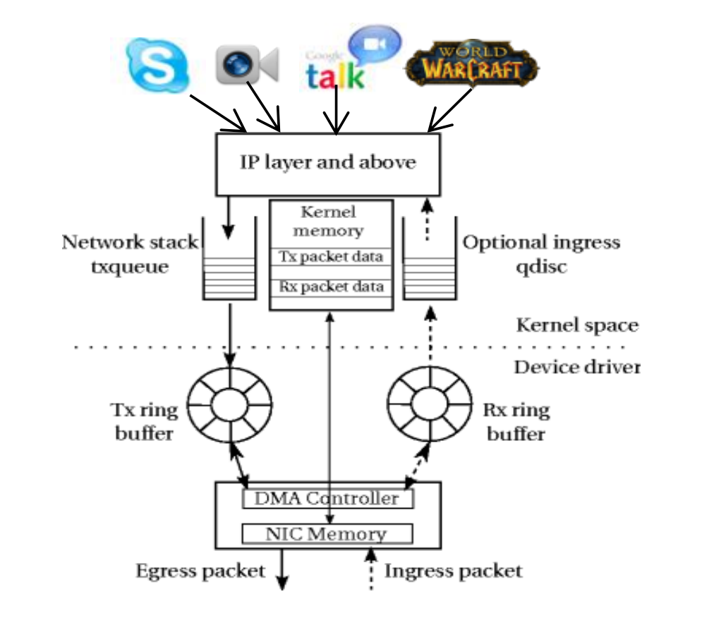
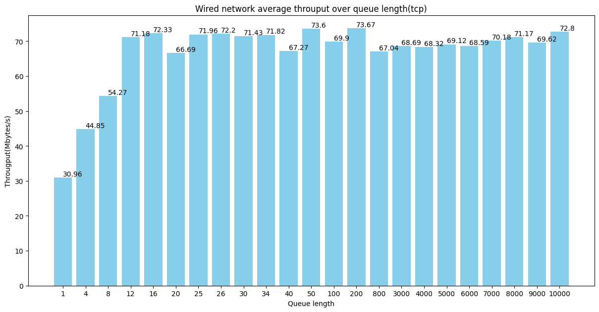
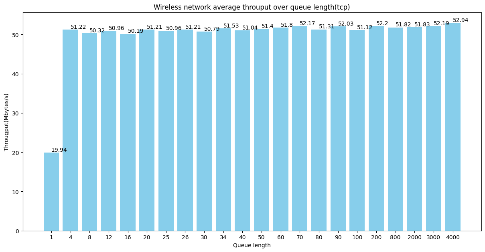
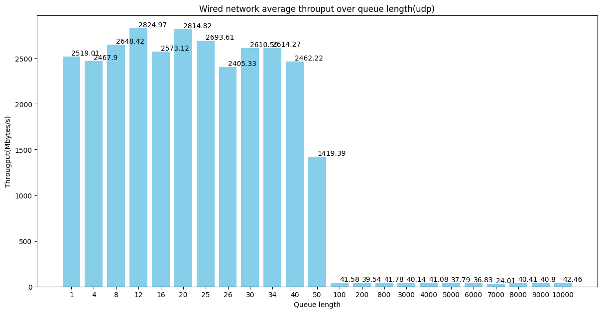
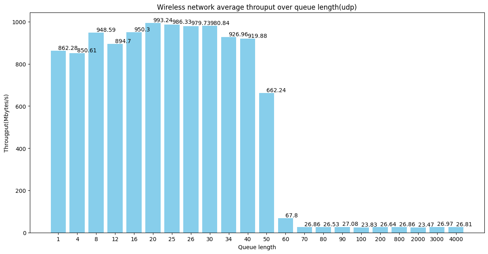
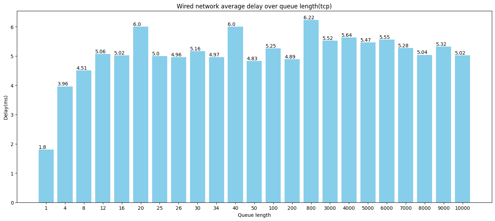
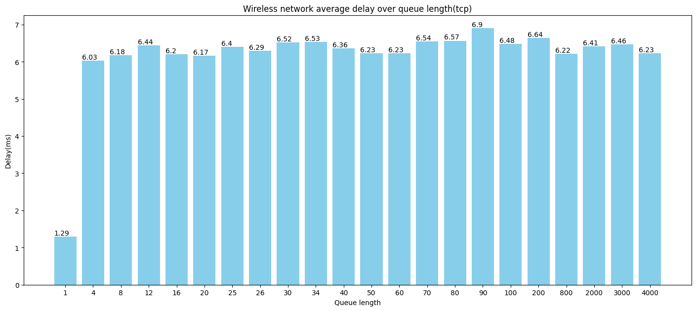

# CS244 Computer Network: Assignment 3
## Background
In this experiment, our task is to observe how changes in queue length within a Linux system affect network throughput and delay. In the Linux queuing structure, two types of queue lengths can be adjusted: the operating system queue length (using the `ip link dev` command) and the hardware queue length of the network device (using the `ethtool` command). On my network hardware, the adjustable queue range for the network adapter is [48, 4096], which is too small to effectively observe experimental phenomena. Based on the assignment requirements, I decided to use the `ip link` command to adjust the operating system queue length in this experiment.

## 1.1 Throughput over Queue Length
According to the TCP protocol, TCP inherently has congestion control mechanisms. Thus, we can predict that adjusting queue length will have some effect on TCP throughput, but the impact will be minimal since the TCP protocol itself aims to ensure the network remains in a high-performance state by performing congestion control.

> Experiment Setting: I will test queue length by applying a fine-to-coarse classification rule. Each queue configuration will be tested five times, with each test lasting 50 seconds. The final data is obtained by averaging the results of all tests. For both throughput and delay measurements of TCP, I used iPerf with JSON output, then parsed the bandwidth and RTT data from the JSON files. For UDP tests, since UDP is a connectionless protocol and does not support RTT measurements, I only analyzed its throughput.

### 1.1.1 Wired Network Throughput (TCP)

### 1.1.2 Wireless Network Throughput (TCP)

>Analysis: Increasing queue length has a positive effect on bandwidth, particularly in wired networks. However, after a certain point, the impact becomes negligible, likely due to device processing limitations and network conditions. In wireless networks, bandwidth improvement is relatively constrained, likely due to the inherent instability of wireless signals. When optimizing network performance, it is necessary to set appropriate queue lengths while also considering the specific network environment and device conditions.

### 1.1.3 Wired Network Throughput (UDP)

### 1.1.4 Wireless Network Throughput (UDP)

>Analysis: For UDP, which lacks congestion control, we would expect throughput to increase as queue length grows. As seen in the graph, there is an upward trend, but at around queue length 50, bandwidth in both wired and wireless networks suddenly drops. This phenomenon defies intuition. Upon analysis, I believe the possible reasons are: 1) Even in wired networks, when the number of packets becomes extremely large, the processing capability of the network interface (e.g., Ethernet card) may become a limiting factor, causing the interface's efficiency to drop. 2) Since I am using a virtual machine with NAT forwarding, the host system itself also has a limit in handling large volumes of data. When the queue length becomes large, this greatly constrains throughput.

## 1.2 TCP Delay over Queue Length
### 1.2.1 Wired Network Delay

### 1.2.2 Wireless Network Delay

>Analysis: In both network environments, increasing queue length generally leads to increased delay, indicating that the buffer size and processing capabilities of the network devices are being challenged. Wireless networks typically exhibit higher latency compared to wired networks, reflecting the inherent instability and complexity of wireless environments. In the wired network, the RTT quickly rises from 1.8 ms to approximately 6 ms as the queue length increases from 1 to 40, and fluctuates around 5.22 ms thereafter. In the wireless network, delay rises sharply above 6 ms and remains high as queue length increases. This behavior aligns with typical network performance as queue length increases.

## Conclusion
Considering both bandwidth and delay, I believe that setting the queue length to 50 provides the optimal network performance in my setup. At this point, the wired network throughput reaches 73.67 MBytes/s, and the wireless network throughput reaches 51.4 MBytes/s. Both values are close to their respective peak performance, while the latency remains relatively low.
